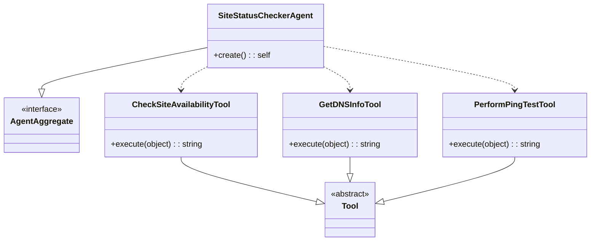

# Site Status Checker Agent 🕵️‍♂️

[](https://packagist.org/packages/llm-agents-php/agent-site-status-checker)
[](https://packagist.org/packages/llm-agents-php/agent-site-status-checker)
[](https://packagist.org/packages/llm-agents-php/agent-site-status-checker)

Hey there! 👋 This package gives you a cool Site Status Checker Agent for your LLM Agents project.


## What's this all about? 🤔

- Check if a site is up and running 🏃‍♂️
- Dig up DNS info 🔍
- Run ping tests 🏓
- Give you the lowdown on why a site might be offline 😴

## Class Diagram 📊

Here's a quick look at how everything fits together:



## Let's get started! 🚀

### Installation

First things first, let's get this package installed:

```bash
composer require llm-agents/agent-site-status-checker
```

### Setup in Spiral Framework

To get the Site Status Checker Agent up and running in your Spiral Framework project, you need to register its
bootloader.

**Here's how:**

1. Open up your `app/src/Application/Kernel.php` file.
2. Add the bootloader like this:
   ```php
   public function defineBootloaders(): array
   {
       return [
           // ... other bootloaders ...
           \LLM\Agents\Agent\SiteStatusChecker\Integrations\Spiral\SiteStatusCheckerBootloader::class,
       ];
   }
   ```

And that's it! Your Spiral app is now ready to use the agent.

## Want to help out? 🤝

We love contributions! If you've got ideas to make this agent even cooler, here's how you can chip in:

1. Fork the repo
2. Make your changes
3. Create a new Pull Request

Just make sure your code is clean, well-commented, and follows PSR-12 coding standards.

## License 📄

This project is licensed under the MIT License - see the [LICENSE](LICENSE) file for details.

---

That's all, folks! If you've got any questions or run into any trouble, don't hesitate to open an issue.